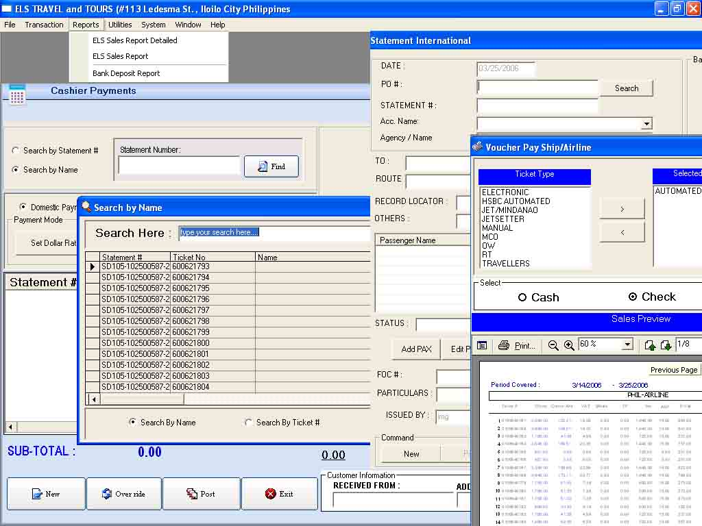



## Full travel Agents Accounting

### Description

This project is a complete package for travel agents

have a look and learn.
 
### More Info
 

             |
---                |---
**Submitted On**   |2006-03-25 16:40:36
**By**             |[Ruperto S\. Javier III](https://github.com/Planet-Source-Code/PSCIndex/blob/master/ByAuthor/ruperto-s-javier-iii.md)
**Level**          |Advanced
**User Rating**    |4.6 (37 globes from 8 users)
**Compatibility**  |VB 3\.0, VB 4\.0 \(16\-bit\), VB 4\.0 \(32\-bit\), VB 5\.0, VB 6\.0, VB Script, ASP \(Active Server Pages\) , VBA MS Access, VBA MS Excel
**Category**       |[Complete Applications](https://github.com/Planet-Source-Code/PSCIndex/blob/master/ByCategory/complete-applications__1-27.md)
**World**          |[Visual Basic](https://github.com/Planet-Source-Code/PSCIndex/blob/master/ByWorld/visual-basic.md)
**Archive File**   |[Full\_trave1983283262006\.zip](https://github.com/Planet-Source-Code/ruperto-s-javier-iii-full-travel-agents-accounting__1-64820/archive/master.zip)

